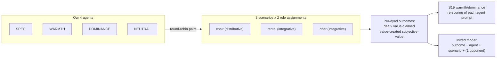
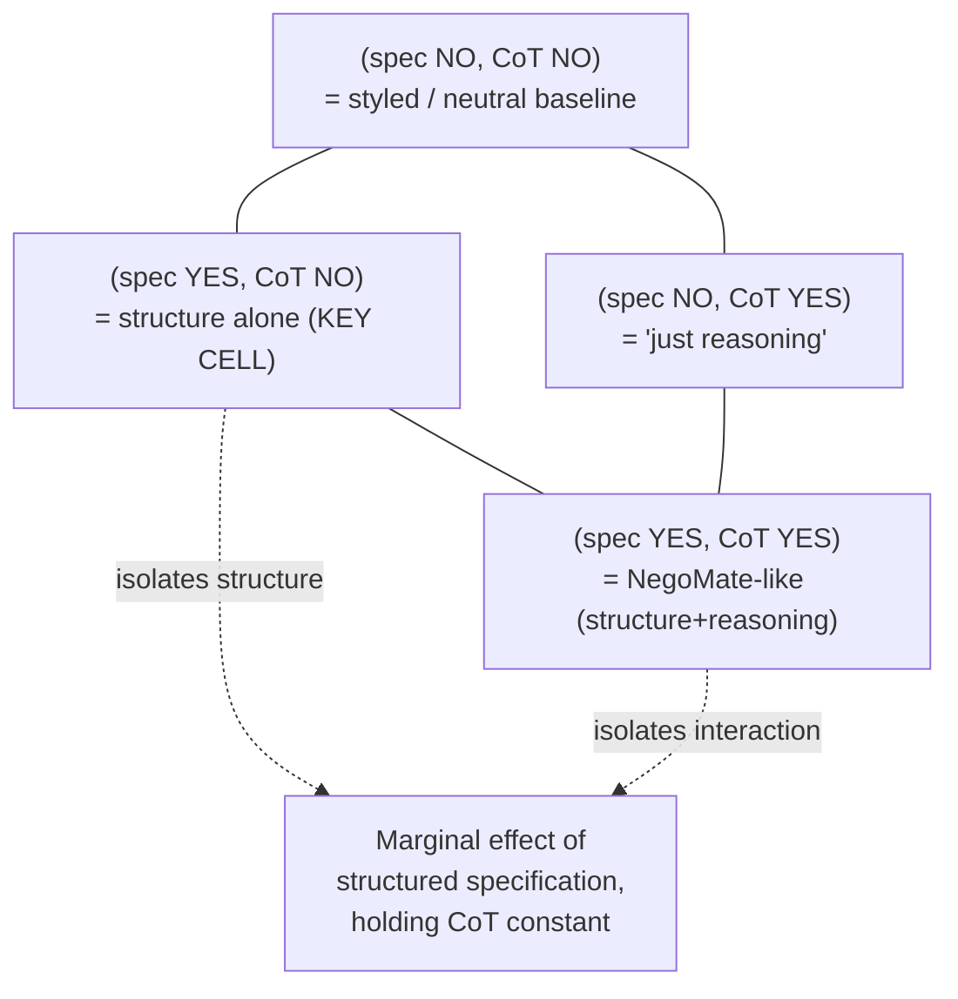

# Spec-Agent vs Styled-Agent in AI-AI Negotiation

## 0. One-paragraph thesis

The MIT competition agents were almost all written in the **usual human idiom** —
persona + behavioral style ("be warm", "anchor hard", run Voss tactics). Warmth
won on most metrics; dominance claimed value but caused impasses. We hypothesize
that a **specification-first agent** — one whose prompt declares an explicit
objective, a reservation/walkaway value, ranked issue priorities with point
weights, an explicit concession rule, and an explicit stop rule — is *not* the
usual move and **outperforms styled agents on value creation (integrative) and on
value claiming without the impasse penalty (distributive)**. The paper's own
top integrative value-creator, **NegoMate**, was structured/"prepare-first" — but
it bundled structure with chain-of-thought (CoT) concealment, so the marginal
contribution of *structure itself* has never been isolated. That gap is the
experiment.

---

## 1. Feasibility of the OSF materials (investigated 2026-06-06)

CRITICAL FINDING: **The OSF data/code project `osf.io/yr9qv` is currently NOT
publicly downloadable.** Replication of the *exact* scenarios cannot be assumed.

### 1.1 What was probed and the result

| Probe | URL | Result |
|---|---|---|
| OSF node metadata | `api.osf.io/v2/nodes/yr9qv/` | **401** "Authentication credentials were not provided" |
| OSF file provider list | `api.osf.io/v2/nodes/yr9qv/files/` | **401** |
| OSF storage tree | `api.osf.io/v2/nodes/yr9qv/files/osfstorage/` | **401** |
| GUID resolve | `api.osf.io/v2/guids/yr9qv/` | **401** |
| Waterbutler file root | `files.osf.io/v1/resources/yr9qv/providers/osfstorage/` | **403 Forbidden** |
| HTML landing page | `osf.io/yr9qv/` | **200**, but JS-rendered empty shell; `last-modified 2026-06-02` |
| Preprint node | `api.osf.io/v2/preprints/b3v9e_v2/` | **200 public** (text of the paper only, no data) |
| Registration | `api.osf.io/v2/registrations/yr9qv/` | **404** |

Interpretation: the project *exists* and was touched four days ago (2026-06-02,
consistent with staging for the PNAS publication), but its files are
contributor-restricted or embargoed **today**. The README distributed with the
paper *describes* a public `code/` + `data/` layout (transcripts, outcomes,
prompts, `score_warmth_dominance.py`, `sample_ablation.py`, etc.), so the intent
is clearly public release — it is plausibly a timing gap, not a permanent
restriction. **This must be re-checked immediately before any run.**

### 1.2 The CRITICAL question — are the confidential role-cards published?

**Unconfirmed and currently inaccessible.** The paper body and SI deliberately
**withhold** the confidential reservation values and issue point-tables from the
prose ("Specific scoring details are withheld from counterparts during play").
The SI references the full exercise text at "SI Sec. 1C.1, Figs. S3–S16" and the
role/instruction sets, which would live in the OSF `data/prompts/` folder — which
we could not open. **We cannot confirm the exact point tables, BATNAs, or
logrolling weight matrices are recoverable.** Therefore the design MUST carry a
self-contained scenario fallback (§3) and treat exact-replication as a
*conditional upgrade*, not the baseline plan.

### 1.3 What IS recoverable today (from the public PDF/SI — high confidence)

- **The harness wrapper, verbatim**: every agent prompt is wrapped in a standard
  system-prompt preface — *"Pretend that you have never learned anything about
  negotiation — you are a clean slate. Instead, determine ALL of your behaviors,
  strategies, and personas based on the following advice:"* — followed by the
  assigned role and scenario instructions. Replicable.
- **Model + decoding**: GPT-4o-mini, **temperature .20**, single system prompt.
- **Warmth/Dominance scoring rubric, verbatim** (SI Fig. S19): a structured LLM
  query returning `{warmth_score, dominance_score}` on 0–100, orthogonal
  constructs. We can re-score our own agents with this exact rubric (note: the
  paper used GPT-5.2 as the scorer — a scorer-drift caveat, §7).
- **Outcome definitions**: deal (binary); value claimed = price-vs-BATNA
  (distributive) / individual points (integrative); value created = joint points
  (integrative only); counterpart subjective value = SVI (4 facets:
  instrumental, self, process, relationship).
- **Cost table (SI Tab. S2)**: GPT-4o-mini ~ **$0.89 / 1k chair negotiations** and
  **$1.55 / 1k rental negotiations**; avg ~3.3k input + ~0.66k output tokens
  (chair), ~5.65k input + ~1.17k output (rental).
- **Power anchor**: their own simulation showed **~200 negotiations/agent** gives
  stable, replicable rankings; the ablation study used 199 counterparts.
- **The exact gap we exploit**: their NegoMate ablation removed only the CoT
  *tagging/concealment* while **retaining** the "mutually beneficial solutions"
  goal wording. They never built a variant that adds *structured specification*
  while holding CoT constant. Our 2×2 (§7) fills precisely that hole.

### 1.4 Feasibility verdict

- **Minimum viable (self-contained scenarios): FEASIBLE NOW.** Everything needed
  — harness wrapper, model/temp, scoring rubric, outcome math, power anchor — is
  in the public PDF. We author our own scenario point-tables.
- **Exact replication (their scenarios + opponent pool): BLOCKED TODAY**, pending
  OSF opening. If `yr9qv` opens, we gain (a) the real role-cards and (b) the
  ability to play against a *sample of the 199 real competition agents* as a
  fixed opponent pool — a major external-validity upgrade. Re-probe before run.

---

## 2. The agents (prompt templates)

All four agents are wrapped in the paper's standard preface + role/scenario block.
Only the **strategy body** differs. The four bodies are matched for length
(±15%) and all receive the *same* private payoff information (their own point
table / BATNA). The only thing that varies is **how that information is turned
into behavior**.

### 2.1 SPEC agent (treatment)

```
You are negotiating. Work only from the specification below. Do not adopt a
persona or a "style." Execute the spec.

OBJECTIVE: Maximize your own total points (integrative) / minimize price paid
  or maximize price received (distributive), subject to the rules below.
RESERVATION / WALKAWAY VALUE: <RV>. Never accept a deal worth less to you than
  <RV>. If no deal at or above <RV> is reachable, decline and take your BATNA.
ISSUE PRIORITIES (ranked, with point weights):
  1. <issue_a> — weight <w_a>  (most valuable to you)
  2. <issue_b> — weight <w_b>
  3. <issue_c> — weight <w_c>
  ...
CONCESSION RULE: Open near your target. Concede on your LOWEST-weight issues
  first; hold firm on your HIGHEST-weight issues. Seek trades that give the
  counterpart a low-weight-to-you issue in exchange for a high-weight-to-you
  issue (logrolling). Make each concession contingent on a reciprocal move.
DECISION RULE: Accept the first offer whose point value to you is >= <RV>
  AND for which no clearly better trade is on the table. Otherwise counter.
STOP RULE: Stop and accept when an offer meets the DECISION RULE, or decline
  and take BATNA after <K> rounds with no offer reaching <RV>.
```

Note: SPEC contains **no warmth and no dominance language** — by construction it
should score *low on both* on the S19 rubric. That is the point: it is an
orthogonal third design axis, not a point on the warmth–dominance plane.

### 2.2 WARMTH agent (control, derived from paper §2.4 + S19 warmth definition)

```
Be friendly, sympathetic, and sociable. Build positive rapport from the first
message. Express empathy and nonjudgmental understanding of the counterpart's
needs. Use gratitude ("thank you", "I appreciate"), ask questions about their
interests, and affirm shared goals. Aim for a deal both sides feel good about.
```

### 2.3 DOMINANCE agent (control, derived from paper §2.4 + S19 dominance definition)

```
Be assertive, firm, and forceful. Advocate hard for your own interests. Open
with an aggressive anchor. Leverage your BATNA explicitly. Respond to
counteroffers by holding your position and pressing for concessions. Do not
soften; do not over-explain.
```

### 2.4 NEUTRAL baseline (control)

```
Negotiate to reach an agreement that is good for you.
```

(Minimal instruction — isolates the *added value of any strategy block* over a
bare goal. Approximates the paper's "unprompted" condition.)

---

## 3. Self-contained scenario set (fallback; default plan)

Three scenarios mirroring the paper's structure. Point tables are **ours**,
authored to create a clean distributive case and clean logrolling cases. Each
role gets a private card; neither sees the other's weights.

| Scenario | Type | Structure | Value-creation source |
|---|---|---|---|
| `chair` | distributive | single-issue price, buyer BATNA vs seller BATNA, positive ZOPA | none (claiming only) |
| `rental` | integrative | tenant–landlord, 3 issues (rent, lease length, repairs) with opposed/aligned weights | logrolling across issues |
| `offer` | integrative | recruiter–candidate, 3 issues (salary, start date, remote days) | logrolling across issues |

Design rules for the tables (so results are interpretable):
- Distributive: fix a known ZOPA width so deal-rate and split are measurable
  against an analytic optimum.
- Integrative: construct issue weights so the joint-optimal (Pareto) point is
  *not* the equal-split point — this is what lets value-creation differ across
  agents. Publish the full payoff matrices (no confidentiality reason to hide
  ours).
- BATNAs set so impasse is a real, scored option (impasse != 0 value; it = BATNA).

If `osf.io/yr9qv` opens: **swap our tables for theirs** and additionally play
against a fixed sample of the 199 real agents. The harness is identical either
way; only the scenario/opponent files change.

---

## 4. Comparison design

Round-robin among the four of our agents, plus self-play, across the three
scenarios. Each agent plays **both roles** in each scenario (counterbalanced) to
remove role advantage.



Cells: 4 agents x 4 opponents (incl. self) x 3 scenarios x 2 role orders = 96
agent-condition combinations; with R replicates per cell (decoding is stochastic
at temp .20). Opponent identity is a random effect.

**Optional opponent-pool variant (if OSF opens):** each of our 4 agents plays
~200 negotiations against a fixed random sample of the real 199 competition
agents per scenario — directly comparable to the paper's leaderboard.

---

## 5. Outcomes and directional hypotheses

Outcomes match the paper exactly (so numbers are comparable).

| # | Outcome | Definition | Directional hypothesis |
|---|---|---|---|
| H1 | Deal rate | P(agreement) | SPEC >= WARMTH > DOMINANCE > NEUTRAL. SPEC avoids the dominance impasse penalty. |
| H2 | Value claimed (distributive) | own surplus vs BATNA, chair | SPEC ~ DOMINANCE > WARMTH > NEUTRAL — **but** SPEC claims *without* the deal-rate loss DOMINANCE suffers (interaction H1×H2). |
| H3 | Value created (integrative) | joint points, rental+offer | **SPEC > all** (explicit logrolling rule). Primary hypothesis. |
| H4 | Value claimed (integrative) | own points, rental+offer | SPEC > WARMTH ~ NEUTRAL; SPEC vs DOMINANCE ambiguous. |
| H5 | Counterpart subjective value | SVI 4-facet mean | WARMTH > SPEC ~ NEUTRAL > DOMINANCE. Predicted SPEC *cost*: structure may read as cold (low warmth on S19) and depress SVI — an honest expected weakness, not hidden. |
| H6 (manipulation check) | S19 warmth & dominance of each agent prompt | SPEC scores LOW on both; WARMTH high-warmth; DOMINANCE high-dominance; NEUTRAL low-low. Confirms SPEC is off the warmth–dominance plane. |

The headline result, if it lands: **SPEC dominates on value created (H3) and gets
distributive value (H2) without the impasse penalty (H1), at a subjective-value
cost (H5)** — i.e. a different and arguably better operating point than anything
on the warmth–dominance frontier the paper mapped.

---

## 6. Sample size, power, cost, time

### 6.1 Sample size

Anchor: the paper's own simulation found **~200 negotiations/agent** stabilizes
rankings; their ablation used **199** counterparts and detected significant
agent-vs-ablated differences. We need to detect *between-our-agents* differences,
which are designed to be larger than ablation-level deltas.

- **MVP target: ~150 dyads per (agent × scenario) cell.** With 4 agents × 3
  scenarios that is **~1,800 negotiations** for the core round-robin (before role
  counterbalancing doubling → ~3,600 if both role orders run fully; ~2,400 is a
  reasonable counterbalanced middle).
- Rationale: a between-agent Cohen's d ~ .3–.4 on a continuous outcome needs
  ~120–175/cell at 80% power, two-sided alpha .05; integrative effects in the
  paper were considerably larger than that, so 150/cell is comfortable and gives
  headroom for the mixed-model random-opponent variance.
- **Full version: ~400 dyads/cell** (~9,600 negotiations) to tighten subjective-
  value (noisier) and to support the 2×2 disentanglement (§7) as a proper
  factorial.

### 6.2 Cost (GPT-4o-mini, from SI Tab. S2)

- Distributive (chair-like): ~$0.89 / 1k negotiations.
- Integrative (rental/offer-like): ~$1.55 / 1k negotiations (longer transcripts).
- Blended ~ **$1.30 / 1k**.

| Scope | Negotiations | API cost (negotiation play) | + S19 scoring + SVI calls* | Rough total |
|---|---|---|---|---|
| Pilot | ~300 | ~$0.40 | ~$1 | **< $2** |
| MVP | ~2,400 | ~$3 | ~$3–6 | **~$5–10** |
| Full + 2×2 | ~12,000 | ~$16 | ~$10–20 | **~$25–40** |

*Subjective-value (SVI) and warmth/dominance scoring are extra LLM calls per
transcript; if SVI is scored with GPT-4o-mini the marginal cost is small. If, to
match the paper, warmth/dominance is scored with a frontier model (they used
GPT-5.2), budget a few extra dollars and a scorer-version note (§7).

**Bottom line: the entire full experiment is well under ~$40 in API spend.** Cost
is a non-issue; the binding constraints are scenario sourcing and scope, not money.

### 6.3 Time

Sequential at temp .20 on gpt-4o-mini: a few seconds to ~30s per negotiation
depending on round count. MVP (~2.4k negotiations) is hours of wall-clock with
modest concurrency. Per project HARD RULE, long runs go as **one sequential
detached job, sandbox-OFF, verify-on-disk** (see
`code/run_atlas_sequential.sh` / `RUN_OPERATIONS.md` pattern; not agent-synchronous).

---

## 7. Threats to validity (and design responses)

| Threat | Why it bites | Design response |
|---|---|---|
| **Spec vs CoT confound** (PRIMARY) | NegoMate bundled structure + CoT concealment; their ablation removed only the *concealment*, never isolating *structure*. If SPEC also reasons step-by-step, "spec wins" could just be "CoT wins." | Run the **2×2 factorial**: {structured-spec: yes/no} × {chain-of-thought: yes/no}. Cell (spec-yes, CoT-no) is the clean test of structure alone. This is the single most important upgrade and is the contribution the paper explicitly flagged as missing future work. |
| **Observational vs experimental** | The paper's warmth→outcome links are correlational across self-selected human prompts. | Ours is *experimental*: agents are randomly assigned, prompts are matched for length, payoff info held constant. Frame the contribution as causal where theirs is associational. |
| **Single-model scope** | All on gpt-4o-mini; AI-specific effects (CoT, injection) are model-sensitive (paper §discussion). | State scope limit explicitly. Optional robustness arm: replay a subset on one other family (e.g., a small open model) to test model-agnosticism of the *structure* effect specifically. |
| **Scorer drift** | Paper scored warmth/dominance with GPT-5.2; we may score with a different model/version. | Pin scorer model+version in logs; report it; if feasible re-score with the same family. Treat H6 as relative-within-our-set, not an absolute leaderboard comparison. |
| **Self-authored scenarios != their scenarios** | Effects could be table-specific. | Publish full payoff matrices; if OSF opens, re-run on their tables as a confirmatory replication. Report both if available. |
| **Prompt-injection arms race** | A dominance/injection opponent could break SPEC's stop rule. | Include one injection-flavored opponent as a stress test; report SPEC's robustness, do not let it dominate the main analysis. |
| **Matched-length / wording artifacts** | "Structure wins" could be a verbosity or specificity artifact. | Length-match all four bodies; NEUTRAL controls for "any strategy block at all"; pre-register the exact prompt texts. |

### 7.1 The 2×2 (the experiment's spine)



---

## 8. Reproducibility, logging, preregistration (project HARD RULES)

- **Per-call structured JSONL logging** (mandatory): every model call logs
  `operator, model_version, temperature, full system+user prompts, params,
  response, prompt_tokens, completion_tokens, latency_ms, usd_cost, git_sha,
  scenario_id, agent_id, role, dyad_id, redacted_secrets`. Reuse / extend
  `research/code/llm_call_logger.py` (single-source schema). Logs published in
  the public mirror at `<paper-slug>/logs/` and cited in an "LLM-call provenance"
  subsection.
- **Companion computation script** (mandatory): the harness runner + scoring +
  stats published under `<paper-slug>/code/` with fixed seed for the *analysis*
  (decoding itself is stochastic — log every call so transcripts are the SSOT,
  not a re-derivable seed), run command in docstring + README, and a "Companion
  Computation Script" subsection in the paper.
- **Preregistration**: register hypotheses H1–H6, the 2×2, primary outcome (H3),
  sample sizes, and analysis model (`outcome ~ agent + scenario + (1|opponent)`)
  on **OSF before any run**. Mint a **Zenodo** DOI for the dataset (transcripts +
  outcomes) and a second for the code, per the dual-DOI public-mirror standard.
- **Public mirror**: new mirror `negotiation-spec-experiment` scaffolded from
  `templates/public-mirror-scaffold/`, compliant with
  `research/PUBLIC_MIRROR_STANDARD.md` (CITATION.cff, dual license,
  reproduce.sh, output/{figures,tables,logs}/). HF dataset DOI for transcripts.
- **Citation discipline**: cite the base paper as
  Vaccaro, Caosun, Ju, Aral & Curhan (2026), PNAS 10.1073/pnas.2521774123. This
  is an *outside-corpus* extension, not an SBT self-citation — no Zharnikov
  citation-key applies. Direction-of-citation: we cite them; we do not bolt SBT
  vocabulary onto a negotiation paper.

---

## 9. Honest verdict

### 9.1 Is it publishable?

**Yes — as a focused empirical note / short preprint**, not a flagship paper. The
contribution is sharp and the gap is real: the base paper mapped the
warmth–dominance frontier and *explicitly named* the spec-vs-CoT disentanglement
as future work. A clean experimental 2×2 that isolates **structured specification
as a third, orthogonal design axis** — and shows it buys value-creation and
penalty-free value-claiming — is a genuine, citable increment. It is the kind of
result that travels (NLP/HCI/negotiation venues, or a strong arXiv note that the
base-paper authors themselves would likely cite).

It is **not** publishable as a grand "new theory of AI negotiation" — that ground
is taken, and our scope (one model, self-authored scenarios in the MVP) is too
narrow for that claim. Keep the framing modest and mechanism-focused.

### 9.2 Minimum viable vs full

| | MVP (publishable note) | Full (stronger) |
|---|---|---|
| Scenarios | self-authored (§3) | + exact OSF replication if `yr9qv` opens |
| Opponents | our 4 agents round-robin | + sample of 199 real competition agents |
| Design | SPEC vs 3 controls, 3 scenarios | + full 2×2 (spec × CoT) factorial |
| N | ~150/cell (~2.4k negotiations) | ~400/cell (~12k negotiations) |
| Models | gpt-4o-mini only | + one other family for the structure effect |
| Cost | ~$5–10 | ~$25–40 |
| The MVP is already enough to publish H1/H3/H6 with the 2×2 as the headline. | | |

Recommendation: **build the MVP harness with the 2×2 baked in from the start**
(it costs almost nothing extra in API and is the strongest single result), run a
~300-negotiation pilot to validate scenarios + scoring + logging, then decide
MVP-vs-full based on the pilot.

### 9.3 Pre-draft gate

Per project rule, a **new R-paper/empirical note triggers the pre-draft Grok
critical-review gate** (`research/reviews/R_PAPER_PREDRAFT_WORKFLOW.md`) before
drafting prose. This document is design/scoping, upstream of that gate. The gate
fires when we move to draft the note.

---

## 10. OPEN DECISIONS — the user must rule on these before any run

1. **API spend approval.** Authorize up to a ceiling (suggest **$40**, which
   covers the full version). Even the full experiment is < ~$40; this is a
   formality but required before any paid call.
2. **Scenario sourcing.** Choose:
   (a) **Self-contained scenarios now** (default, unblocked), or
   (b) **wait/attempt to obtain the OSF role-cards** (re-probe `yr9qv`; possibly
   email the authors for access), or (c) **both** — self-contained for the MVP,
   exact replication as a confirmatory add-on if OSF opens. Recommend (c).
3. **Scope: MVP vs Full at launch.** Run the MVP (~$5–10) first and decide after
   pilot, or commit to Full (2×2 + opponent pool + second model) up front?
   Recommend MVP-first with the 2×2 included.
4. **OSF re-probe / author contact.** Approve (or not) re-checking `osf.io/yr9qv`
   right before the run, and whether to contact Vaccaro/Curhan for the role-cards
   and the 199-agent opponent pool. (Affects external validity and citation
   relationship; the base authors would be natural reviewers/citers.)
5. **Model scope.** gpt-4o-mini only (matches paper, cleanest comparison), or add
   a second model family to test whether the *structure* effect is model-agnostic?
6. **Scorer model for warmth/dominance + SVI.** Match the paper's frontier scorer
   (they used GPT-5.2) for comparability, or use gpt-4o-mini to save cost and
   accept a within-set-only manipulation check (H6)?
7. **Pre-draft gate timing.** Confirm the Grok pre-draft review fires when we move
   from this design to drafting the empirical note (not before the run).

NO negotiations are run and NO API budget is spent until the user issues
**GO / REVISE / DROP** with decisions 1–3 at minimum resolved.
