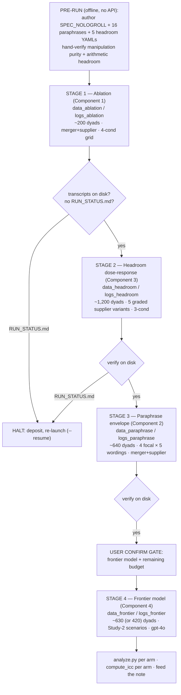

# Full Extension Design

The user approved running a **full robustness extension BEFORE drafting the empirical note**.
This document specifies four runnable extension components, a single sequenced detached run
plan, a cost/time estimate, and a preregistration-amendment stub. **Nothing here has been
run. No API call has been made.** Launch is gated on user GO + two confirmations (frontier
model, total budget).

## 0. What already exists (the baseline this extends)

Three completed arms, **630 dyads each** (the grid is 6 conditions → 21 unordered condition
pairs incl. self-play × 3 scenarios × 2 role orders × 5 replicates = 630):

| Arm | Model | Scenarios | Headroom | Primary (H3) result |
|---|---|---|---|---|
| A — Study 1 | gpt-4o-mini @ .20 | chair / rental / offer | ~3% (ceiling) | NULL — SPEC ties all cooperative controls |
| B — Study 2 | gpt-4o-mini @ .20 | merger / supplier / salvage | 31–46% | **SPEC WINS** (SPEC_NOCOT − NEUTRAL +54.2, d = .314, p = .009) |
| C — Haiku | claude-haiku-4-5 | chair / rental / offer | ~3% | core null replicates; SPEC_COT beats COT/WARMTH strongly |

The headline causal story (SPEC creates value **when there is headroom**) rests on Arm B. The
four extension components below pressure-test that story from four independent directions:
**(1)** is the SPEC win real strategy or a leaked payoff matrix; **(2)** is it robust to prompt
wording; **(3)** does it scale smoothly with headroom; **(4)** does it scale with model capability.

### 0.1 Harness facts the design relies on (verified in code)

- Condition prompt body = `prompts/{CONDITION}.txt`, loaded by name in
  `negotiation_runner.py:_load_prompt_body`. A new condition = a new `.txt` file + adding the
  ID to `CONDITIONS` in `run_experiment.py:100` (or running a restricted pair set).
- The grid auto-derives role pairs from each scenario YAML's `roles:` list
  (`_extract_roles_from_yaml`), so **new scenarios need no code change** — drop a schema-valid
  YAML into a scenarios dir and pass `--scenario-ids`.
- Per-dyad scoring (when `--score`) = 2 agents × 2 scorers (`gpt-4o`, `claude-haiku-4-5`) ×
  {warmth/dominance, SVI} = **8 scoring calls/dyad**, temp 0, ≤200 tokens each.
- Isolation flags: `--data-dir` (transcripts + outcomes.csv root), `--logs-dir` (JSONL),
  `--scenarios-dir`, `--scenario-ids`, `--model`, `--temp`, `--replicates`, `--budget-stop USD`
  (logger sums `cost_usd_est`, aborts at the cap), `--resume` (transcript-keyed idempotency),
  `--preflight` (1-token reachability probe per required model).
- Sub-grid sizing: dyad count = (#condition pairs touched) × (#scenarios) × 2 role orders ×
  `--replicates`. The full 6-condition grid = 21 pairs; a restricted contrast touches fewer.

---

## 1. Component 1 — Logrolling-sentence ablation (THE CRITICAL TEST)

### 1.1 Hypothesis

Arm B showed SPEC creates value on high-headroom scenarios. There are two rival explanations:

- **H-strategy** (the claim we want to defend): SPEC wins because it *teaches an integrative
  procedure* — rank your issues by weight, concede low-weight first, seek asymmetric trades.
- **H-leak** (the threat): SPEC wins because the prompt body, by naming "weights" and
  "logrolling," effectively *hands the agent the structure of the payoff matrix*, and any
  agent told "trade low-value-to-you for high-value-to-you" wins regardless of genuine
  strategy. (Note: every condition already receives its own numeric payoff card at the harness
  level per PREREGISTRATION §8a; the question is whether the *logrolling instruction* is the
  active ingredient.)

The ablation isolates the single sentence that most directly encodes the integrative move.

### 1.2 The exact sentence removed

From `prompts/SPEC_NOCOT.txt` line 9 (the CONCESSION RULE), the **third sentence** is removed
verbatim:

> Seek trades that give the counterpart a low-weight-to-you issue in exchange for a
> high-weight-to-you issue (logrolling).

The surrounding CONCESSION RULE sentences are **retained** (open near target; concede
lowest-weight issues first; make concessions contingent on reciprocity). So `SPEC_NOLOGROLL`
keeps the full ranked-weight specification and the concession ordering — it removes *only* the
explicit instruction to construct cross-issue asymmetric trades. This is the cleanest possible
excision: it holds structure (ranked weights + reservation + stop rule) constant and removes
the one clause that names the integrative mechanism.

`prompts/SPEC_NOLOGROLL.txt` (full body, length-matched to SPEC_NOCOT within ±15%):

```
You are negotiating. Work only from the specification below. Do not adopt a persona or a "style." Execute the spec.

OBJECTIVE: Maximize your own total points (integrative) / minimize price paid or maximize price received (distributive), subject to the rules below.
RESERVATION / WALKAWAY VALUE: <RV>. Never accept a deal worth less to you than <RV>. If no deal at or above <RV> is reachable, decline and take your BATNA.
ISSUE PRIORITIES (ranked, with point weights):
  1. <issue_a> — weight <w_a>  (most valuable to you)
  2. <issue_b> — weight <w_b>
  3. <issue_c> — weight <w_c>
CONCESSION RULE: Open near your target. Concede on your LOWEST-weight issues first; hold firm on your HIGHEST-weight issues. Make each concession contingent on a reciprocal move.
DECISION RULE: Accept the first offer whose point value to you is >= <RV> AND for which no clearly better trade is on the table. Otherwise counter.
STOP RULE: Stop and accept when an offer meets the DECISION RULE, or decline and take BATNA after <K> rounds with no offer reaching <RV>.
```

(Diff vs SPEC_NOCOT: exactly the logrolling sentence deleted from the CONCESSION RULE; "Seek
trades…" gone, everything else byte-identical.)

### 1.3 Design

- **Scenarios:** Study-2 HARD set — `merger`, `supplier` (integrative, where SPEC wins).
  `salvage` (distributive) is **excluded**: logrolling is undefined on a single-issue scenario,
  so it would add cost with no inferential value for this test.
- **Conditions contrasted:** run `SPEC_NOLOGROLL` against the **already-collected** Arm B cells
  for `SPEC_NOCOT`, `COT_ONLY`, and `NEUTRAL`. To get a self-contained, identically-decoded
  comparison set (not relying on cross-run drift), run a **restricted 4-condition grid**:
  `{NEUTRAL, COT_ONLY, SPEC_NOCOT, SPEC_NOLOGROLL}` round-robin on `merger` + `supplier`.
  4 conditions → 10 unordered pairs (incl. self-play) × 2 scenarios × 2 role orders × 5
  replicates = **200 dyads**. (This re-collects NEUTRAL/COT_ONLY/SPEC_NOCOT under the new
  condition set so all four are decoded in one run — cleaner than splicing Arm B.)
- **N rationale:** 200 dyads here ≈ Arm B's per-cell density on the integrative pair; the
  SPEC_NOCOT − NEUTRAL effect in Arm B was d ≈ .31 detected at p = .009 with this density, so
  the ablation contrast has comparable power.

### 1.4 Expected result (falsification logic)

| Pattern | Interpretation |
|---|---|
| `SPEC_NOLOGROLL` ≈ `NEUTRAL`/`COT_ONLY` and **<** `SPEC_NOCOT` on value created | **H-strategy SUPPORTED.** The logrolling instruction is the active ingredient; removing it removes the win. This is the result that *strengthens* the note. |
| `SPEC_NOLOGROLL` ≈ `SPEC_NOCOT` (still beats controls) | **H-leak SUPPORTED.** The win survives without the explicit logroll clause → SPEC's advantage comes from ranked-weight structure exposure, not the named integrative move. The note must reframe: "structured weight disclosure," not "taught logrolling." |
| `SPEC_NOLOGROLL` intermediate | Partial: both structure-exposure and the explicit clause contribute. Report the decomposition. |

Either of the first two is publishable and sharpens the mechanism claim. This is the single
most important robustness component — it converts "SPEC wins" into "SPEC wins *because X*."

### 1.5 Gate + output

- Pre-run gate (reuse PREREGISTRATION §5/§7): NEUTRAL deal rate ∈ [.3, .95] on merger+supplier
  (already PASS in Arm B pilot: .769 / .833); scorer ICC ≥ .70 (already PASS: .919 / .944 on
  Study-2 transcripts). No new pilot needed — the scenarios and scorers are unchanged; only the
  prompt set changes, and SPEC_NOLOGROLL is a strict subset of an already-gated prompt.
- Output: `data_ablation/outcomes.csv` + `logs_ablation/`. Feeds note §"Mechanism: is it
  strategy or leakage?" — the methods-reviewer's first question, answered pre-emptively.

---

## 2. Component 2 — Prompt-paraphrase robustness envelope

### 2.1 Hypothesis

The Arm B result must not be an artifact of one exact wording. If SPEC's value-creation
advantage is real, it should survive **semantically-equivalent paraphrases** of each condition
body. The test reports, per condition, the **min/max bound** on value created across K
paraphrases — a robustness envelope, not a point estimate.

### 2.2 K and the blow-up problem

One could run up to ~8–10 paraphrases. A naive "K paraphrases × every condition × full grid"
multiplies the 630-dyad Arm B by K — at K = 8 that is ~5,000 dyads for this component alone,
which dominates the whole budget for marginal inferential gain. **Recommend K = 4** paraphrases
per *paraphrased* condition (the original wording = a 5th anchor point), and **paraphrase only
4 of the 6 conditions** — the ones whose wording the inference depends on:

- `SPEC_NOCOT` (the treatment),
- `COT_ONLY` (the structure-controlled comparison),
- `WARMTH` (the styled control SPEC must beat),
- `NEUTRAL` (the floor).

`SPEC_COT` and `DOMINANCE` are **not** paraphrased (DOMINANCE is a negative control whose exact
wording is not inferentially central; SPEC_COT's robustness is covered indirectly by SPEC_NOCOT
+ COT_ONLY paraphrases). K = 4 gives a 5-point envelope per condition — enough to bound the
effect, cheap enough to fit the budget.

### 2.3 Tractable design (paraphrase-vs-original within a fixed opponent)

Running paraphrases round-robin against each other explodes combinatorially. Instead, hold the
**opponent fixed** and vary only the focal agent's paraphrase:

- For each of the 4 paraphrased conditions, build paraphrase variants `_p1…_p4` as new prompt
  files (e.g. `prompts/SPEC_NOCOT_p1.txt`). The **manipulation must be preserved**: a SPEC
  paraphrase keeps objective + reservation + ranked weights + concession/decision/stop rules
  and adds **no warmth, no rapport, no dominance** language; a WARMTH paraphrase keeps
  friendliness and adds no spec structure. (Authoring rule §2.5.)
- Opponent is fixed to `NEUTRAL` (original wording) — a neutral, stable backboard so the
  envelope reflects the focal paraphrase, not opponent interaction.
- Scenarios: `merger` + `supplier` (where the effect lives).
- Cells: 4 conditions × (4 paraphrases + 1 original) × 2 scenarios × 2 role orders × 8
  replicates = 4 × 5 × 2 × 2 × 8 = **640 dyads**. (8 replicates/cell because each cell is now a
  single focal-vs-NEUTRAL match, not a 21-pair round-robin; 8 reps gives a stable per-paraphrase
  mean.)

This is implemented either as 4 separate restricted runs (one per focal condition, opponent
pinned) or, more simply, by adding the 16 paraphrase prompt files + 4 originals to a dedicated
`CONDITIONS`-restricted run. Each focal run isolates to its own `--data-dir`.

### 2.4 Expected result + output

- Expected: the SPEC_NOCOT value-created envelope **min** still exceeds the WARMTH/NEUTRAL
  envelope **max** (non-overlapping → wording-robust). If envelopes overlap, the effect is
  wording-fragile and the note must report the bound honestly.
- Output: `data_paraphrase/outcomes.csv` + a per-condition min/max table for the note's
  robustness section. Reported as exploratory (envelope), not a new confirmatory test.

### 2.5 Paraphrase authoring + validation rule (HARD)

Paraphrases are authored in a **separate offline step before the run** (no API needed to
author; do it by hand or with an LLM but then hand-verify), and **each paraphrase is scored by
the existing H6 manipulation check on the pilot**: a SPEC paraphrase must score LOW-LOW on the
S19 warmth/dominance rubric; a WARMTH paraphrase must score HIGH-warmth. Any paraphrase that
drifts off its manipulation (e.g. a SPEC paraphrase that reads warm) is **discarded and
re-authored before the main run** — this is a logged pre-run gate, mirroring the rubric-v2.1
discipline. Fully in-language (English), no mixed-language. Memory rule
[native_language_prompts] applies.

---

## 3. Component 3 — Continuous headroom design

### 3.1 Hypothesis

The central causal claim is **SPEC-advantage is a function of headroom**: ~0 at the Study-1
ceiling (~3%), large at Study-2 headroom (31–46%). Currently that is a **two-point contrast**
(easy vs hard) — it shows the sign flips but not the *shape*. Component 3 grades headroom across
5 levels and tests the **interaction / slope**: does SPEC's value-created advantage rise
monotonically with available headroom? A clean positive slope is the strongest possible support
for the ceiling-dependence thesis and pre-empts the "you just picked two convenient scenarios"
critique.

### 3.2 Approach — retune ONE scenario family to 5 graded headroom levels

Authoring 5 unrelated scenarios confounds headroom with scenario content. Instead, **take the
`supplier` scenario as the template and produce 5 variants** (`supplier_h05 … supplier_h50`)
that hold the issue structure, roles, and prose **identical** and vary **only the payoff tables**
to hit target headroom ≈ 5%, 15%, 25%, 40%, 50%. Headroom is fully controllable analytically
because the YAML publishes naive-joint and Pareto-joint (see `supplier.yaml` lines 19–30):

> headroom = (Pareto_joint − naive_joint) / Pareto_joint

The single lever is the **weight asymmetry on the logroll + compatible issues** (warranty,
volume). Concretely, for the `supplier` template:

| Variant | Target headroom | Lever (vs base supplier: naive 520 / Pareto 960 = 46%) |
|---|---|---|
| `supplier_h05` | ~5% | flatten warranty + volume asymmetry so naive split ≈ Pareto (warranty 1y→3y gap small; volume compatible-but-shallow). Mirrors Study-1 ceiling. |
| `supplier_h15` | ~15% | mild asymmetry; naive ≈ 815 / Pareto ≈ 960. |
| `supplier_h25` | ~25% | moderate; naive ≈ 720 / Pareto ≈ 960. |
| `supplier_h40` | ~40% | strong; naive ≈ 576 / Pareto ≈ 960. |
| `supplier_h50` | ~50% | base supplier territory or slightly steeper; naive ≈ 480 / Pareto ≈ 960. |

Each variant's exact payoff tables are authored offline and **arithmetically verified**
(naive-joint, equal-split-joint, Pareto-joint computed and checked into the YAML header, exactly
as the existing Study-2 scenarios are) **before any run**. The runner needs no code change —
they are 5 schema-valid YAMLs in a new `scenarios_headroom/` dir.

### 3.3 Design

- **Conditions:** a restricted 3-condition contrast is sufficient and cost-disciplined:
  `{NEUTRAL, COT_ONLY, SPEC_NOCOT}` — NEUTRAL anchors the headroom measurement (NEUTRAL's
  value-created / Pareto fraction *operationalizes* realized headroom per scenario), COT_ONLY is
  the structure-held-constant comparison, SPEC_NOCOT is the treatment.
- **Dyads per headroom bin:** a target of ~400/bin would give 2,000 dyads for this
  component, ~$3–4 of play — affordable. But a 3-condition round-robin = 6 pairs × 1 scenario ×
  2 role orders × R reps; to hit ~400 dyads/bin needs R ≈ 33 reps. **Recommend a middle target
  of ~240 dyads/bin** (6 pairs × 2 role orders × 20 reps = 240), which still gives ~80
  SPEC_NOCOT−NEUTRAL comparison dyads/bin — enough to estimate a per-bin effect and fit a slope
  across 5 bins. 5 bins × 240 = **1,200 dyads**. (If the pilot slope is noisy, scale the two
  end bins to 400 in a logged amendment.)
- **Test:** mixed model `value_created ~ spec × realized_headroom + (1|opponent) + (1|dyad)`,
  with `realized_headroom` measured per scenario as 1 − (NEUTRAL value-created / Pareto). The
  key estimand is the **spec × headroom interaction coefficient** (slope of SPEC advantage on
  headroom). Pre-specify a positive-slope directional prediction.

### 3.4 Gate + expected result + output

- Pre-run gate: each variant must pass deal-rate ∈ [.3, .95] for NEUTRAL on a tiny per-variant
  pilot (5 dyads/variant, ~25 dyads total, cheap) AND the **realized** NEUTRAL headroom must
  track the *target* headroom monotonically (h05 < h15 < h25 < h40 < h50). If a variant's
  realized headroom inverts the intended order, retune its weights in a logged amendment before
  the main run (never after seeing SPEC results).
- Expected: monotone-increasing SPEC_NOCOT − NEUTRAL value-created delta across bins; near-zero
  at h05 (replicating the Study-1 ceiling within one scenario family), largest at h40/h50. A
  significant positive spec×headroom interaction.
- Output: `data_headroom/outcomes.csv` + a slope figure (SPEC advantage vs realized headroom).
  This is the note's strongest single figure — it turns a 2-point sign-flip into a dose-response
  curve. **This component is the most scientifically valuable of the four** and worth protecting
  in the budget.

---

## 4. Component 4 — Extra frontier model

### 4.1 Hypothesis

Does the SPEC (and SPEC_COT) advantage **scale with model capability**? The base paper's own
discussion flags that AI-specific effects (CoT, structure) are model-sensitive. We have
gpt-4o-mini (small OpenAI) and claude-haiku-4-5 (small Anthropic). A frontier-tier model tests
whether structure helps more, less, or the same as capability rises. A capability-scaling result
(SPEC_COT advantage grows with model strength) would be a notable extension; a flat result
(structure helps small models, washes out on strong models that already negotiate well) is also
publishable and theoretically interesting (structure as a *scaffold* that strong models
internalize).

### 4.2 Recommended model + alternates

**Recommended: `gpt-4o`** (full, not mini).
- Cleanest scientific contrast: same provider + family as the Study-1/2 primary (`gpt-4o-mini`),
  so the *only* moving part is capability — isolates the capability axis without a family
  confound. It is also already the warmth/dominance **scorer**, so it is provisioned/reachable.
- Pricing assumption (state explicitly): gpt-4o ≈ **$2.50 / 1M input, $10 / 1M output**, vs
  gpt-4o-mini ≈ $0.15 / $0.60 — roughly **15–17× the per-token cost**. On the base-paper token
  profile (~3.3k in + .66k out chair; ~5.65k in + 1.17k out rental), gpt-4o play ≈ **$20–28 /
  1k integrative negotiations** vs gpt-4o-mini's ~$1.55/1k.

**Alternate 1: `claude-sonnet-4-5`** (frontier Anthropic). Tests capability-scaling in the
*cross-family* direction (pairs with the haiku arm). Pricing assumption: Sonnet 4.5 ≈ $3 / 1M
input, $15 / 1M output. Implication: pulls more spend onto the **Anthropic** balance — and
Anthropic balance has run dry mid-run before (§Run Plan), so this needs a deposit check first.

**Alternate 2: `gpt-4.1`** (if a GPT-4.1-class frontier is preferred over 4o). Same-provider
capability contrast, similar order-of-magnitude cost to gpt-4o.

**This is the choice most needing user confirmation** — it dominates the extension budget (see
§6) and determines which provider balance to top up. Recommendation: **gpt-4o**, for the clean
single-axis (capability) contrast and because it is OpenAI (the primary's provider, no new
balance risk introduced by the *play* model; the Anthropic scorer is unchanged).

### 4.3 Design

- Re-run the **core Study-2 contrast** (the arm where SPEC wins) on the frontier model:
  full 6-condition grid on `merger` + `supplier` + `salvage` (= Study-2 scenarios), `--score`.
  That is the **same 630-dyad grid** as Arm B but `--model gpt-4o`. Re-running all 6 conditions
  (not a restricted set) keeps it a true replication of Arm B at higher capability, so every
  Study-2 contrast (H1–H6) is re-estimable at the frontier.
- **Cost-control option** if budget is tight: drop `salvage` (distributive, least central to the
  value-creation story) and run merger+supplier only → 6 conditions × 2 scenarios × 2 orders × 5
  reps = 420 dyads instead of 630. Flagged as the budget lever for this component.

### 4.4 Gate + expected result + output

- Pre-run gate: `--preflight` must show the frontier model reachable; a 20-dyad scored pilot
  must hit deal-rate ∈ [.3, .95] and scorer ICC ≥ .70 on frontier transcripts (the rubric may
  behave differently on more fluent prose — verify before scaling). Hard budget stop at the cap.
- Expected: SPEC_COT remains top on expected value; the **open question** is whether
  SPEC_NOCOT − NEUTRAL grows (capability amplifies structure) or shrinks (strong models find the
  logroll unaided — a *new ceiling* at high capability, which would be a striking result echoing
  the Study-1 ceiling mechanism one level up).
- Output: `data_frontier/outcomes.csv` + `logs_frontier/`. Feeds note §"Does structure scale
  with capability?" and the single-model-scope threat in EXPERIMENT_DESIGN §7.

---

## 5. Sequenced run plan (ONE detached chain; verify-on-disk)

### 5.1 HARD RULES baked in (project memory)

- **Sandbox OFF** for all real runs (sandbox SIGKILLs long jobs → rc 137).
- **ONE sequential detached job.** Never two concurrent `uv run` jobs — both share
  the `(gpt-4o + claude-haiku-4-5)` **scorer pair**; a 2nd concurrent job SIGKILLed the haiku arm
  at dyad 25/630 on 2026-06-06. Every component below `--score`s with that same pair, so **no two
  components may run concurrently.** They run as a chain, exactly like
  `run_chain_haiku_then_study2.sh`.
- **Isolated dirs per component** (`--data-dir` / `--logs-dir` / `--scenarios-dir`) — no two
  arms ever write the same `outcomes.csv` or scorer logs.
- **Verify-on-disk** after each stage (count transcripts, check no `RUN_STATUS.md`), never trust
  exit 0.
- **Balance-pause aware:** Anthropic balance ran dry mid-run before; the runner writes
  `<data-dir>/RUN_STATUS.md` and pauses gracefully. The chain HALTS if it sees RUN_STATUS.md
  (deposit → re-launch same command → `--resume` skips completed dyads).

### 5.2 Recommended ordering (cheap+critical first, expensive+confirm-gated last)



Rationale for the order: Stage 1 (ablation) is the cheapest and most inferentially critical —
run it first so a "SPEC win is leakage" result (if it lands) reshapes the whole note before
spending on the rest. Stage 2 (headroom) is the highest-value figure and still cheap. Stage 3
(paraphrase) is robustness padding. Stage 4 (frontier) is **last and gated on explicit user
re-confirmation** because it costs more than Stages 1–3 combined and decides which provider
balance to top up.

### 5.3 The chain script (authored at run time)

Launch idiom (a single sequenced, detached job that runs each extension stage in order):

```bash
nohup bash run_chain_extension.sh > run_chain_extension.log 2>&1 &
```

Stage bodies (each isolated; API keys injected from the environment at run time):

```bash
RUNNER="uv run --with openai --with anthropic --with pyyaml --with numpy python code/run_experiment.py"

# STAGE 1 — ablation (4-condition restricted grid; merger+supplier)
$RUNNER --model gpt-4o-mini --score \
  --scenarios-dir scenarios_study2 --scenario-ids merger,supplier \
  --conditions NEUTRAL,COT_ONLY,SPEC_NOCOT,SPEC_NOLOGROLL \
  --data-dir data_ablation --logs-dir logs_ablation --budget-stop 38

# STAGE 2 — headroom dose-response (3-condition; 5 graded variants)
$RUNNER --model gpt-4o-mini --score \
  --scenarios-dir scenarios_headroom \
  --scenario-ids supplier_h05,supplier_h15,supplier_h25,supplier_h40,supplier_h50 \
  --conditions NEUTRAL,COT_ONLY,SPEC_NOCOT --replicates 20 \
  --data-dir data_headroom --logs-dir logs_headroom --budget-stop 38

# STAGE 3 — paraphrase envelope (focal-vs-NEUTRAL; merger+supplier)
$RUNNER --model gpt-4o-mini --score \
  --scenarios-dir scenarios_study2 --scenario-ids merger,supplier \
  --conditions <focal+paraphrase set, opponent pinned NEUTRAL> --replicates 8 \
  --data-dir data_paraphrase --logs-dir logs_paraphrase --budget-stop 38

# STAGE 4 — frontier model (Study-2 grid) — RUN ONLY AFTER USER CONFIRM
$RUNNER --model gpt-4o --score \
  --scenarios-dir scenarios_study2 --scenario-ids merger,supplier,salvage \
  --data-dir data_frontier --logs-dir logs_frontier --budget-stop <frontier-cap>
```

### 5.4 SMALL HARNESS CHANGE REQUIRED (flag this)

The runner currently has **no `--conditions` flag** — `CONDITIONS` is a module constant
(`run_experiment.py:100`) and `--scenario-ids` exists but no condition-subset selector. Stages
1–3 all need a restricted condition set. **Required pre-run additive change:** add a
`--conditions id1,id2,...` argument that overrides `CONDITIONS` for the grid build (mirrors the
existing `--scenario-ids` pattern in `build_grid`). This is a ~15-line additive change, must be
unit-tested (extend `test_robustness.py`), and must NOT alter default behavior (omitted →
current 6-condition list). For the paraphrase stage, an opponent-pinning option (focal condition
× fixed opponent, rather than full round-robin) is also needed; simplest implementation is a
`--opponent NEUTRAL` flag that, when set, pairs every focal condition only against that opponent
instead of round-robin. Both are logged as harness-correctness changes (no hypothesis change),
exactly like Study-1 Amendment 8a.

---

## 6. Cost + time estimate

### 6.1 Pricing assumptions (state explicitly)

- **Play, gpt-4o-mini** (from base-paper SI Tab. S2, EXPERIMENT_DESIGN §6.2): distributive
  ~$0.89/1k, integrative ~$1.55/1k; Study-2 5-issue/4-issue scenarios run a little longer →
  budget **~$1.8/1k** for merger/supplier integrative play.
- **Scoring** (8 calls/dyad, ≤200 output tokens, temp 0; scorers gpt-4o + claude-haiku-4-5):
  Study-2 scored-pilot was **$0.18 for 20 dyads ≈ $9/1k dyads** all-in (play was tiny there;
  scoring dominated). Use **~$9/1k dyads** for scoring on any `--score` arm — this is the real
  cost driver, not the play.
- **Play, gpt-4o (frontier, Component 4):** ~15–17× mini → **~$25/1k integrative negotiations**
  (assumption: $2.50/1M in, $10/1M out, base-paper token profile). Scoring unchanged (~$9/1k;
  scorers are still the cheap pair, not the frontier model).

So a scored gpt-4o-mini arm ≈ **(~$1.8 play + ~$9 scoring)/1k ≈ ~$11/1k dyads**; a scored gpt-4o
arm ≈ **(~$25 play + ~$9 scoring)/1k ≈ ~$34/1k dyads**.

### 6.2 Per-component estimate

| Component | Model | Dyads | Play $ | Scoring $ | Component $ |
|---|---|---|---|---|---|
| 1 — Ablation | gpt-4o-mini | 200 | ~$0.36 | ~$1.80 | **~$2.2** |
| 3 — Headroom | gpt-4o-mini | 1,200 (+~25 pilot) | ~$2.20 | ~$11.0 | **~$13** |
| 2 — Paraphrase | gpt-4o-mini | 640 | ~$1.15 | ~$5.80 | **~$7** |
| 4 — Frontier | **gpt-4o** | 630 (or 420) | ~$16 (630) / ~$10 (420) | ~$5.7 (630) | **~$22 (630) / ~$15 (420)** |
| **TOTAL (gpt-4o, 630)** | — | **~2,670** | — | — | **~$44** |
| **TOTAL (gpt-4o, 420 frontier)** | — | **~2,460** | — | — | **~$37** |
| **TOTAL (Sonnet-4.5 frontier, 630)** | — | ~2,670 | ~$19 play | — | **~$47** |

Stages 1–3 (gpt-4o-mini only) total **~$22** and sit comfortably under a single **$40** ceiling.
Component 4 is the swing factor: with gpt-4o on the full Study-2 grid the extension total is
**~$44**; trimming `salvage` brings it to **~$37**.

### 6.3 Recommended budget ceilings

- **Stages 1–3 ceiling: $30** (covers ~$22 with headroom; `--budget-stop 38` already guards).
- **Stage 4 (frontier) ceiling: $25** as a separate, user-confirmed budget (covers gpt-4o 630
  at ~$22 with margin; set `--budget-stop` to the frontier-specific cap, NOT the shared 38).
- **Total extension ceiling to authorize: ~$50** (= $30 + $25, rounded up for retries/pilots).

### 6.4 Wall-clock

Sequential at temp .20, gpt-4o-mini ≈ a few seconds to ~30s/negotiation incl. 8 scoring calls.
Empirically the 630-dyad Study-2 arm ran in single-digit hours.

| Stage | Dyads | Est. wall-clock |
|---|---|---|
| 1 — Ablation | 200 | ~1–2 h |
| 3 — Headroom | ~1,225 | ~5–9 h |
| 2 — Paraphrase | 640 | ~3–5 h |
| 4 — Frontier (gpt-4o slower) | 630 | ~6–12 h |
| **TOTAL (one chain, sequential)** | ~2,670 | **~15–28 h** |

Plan for the chain to span **2–3 detached sessions** (it survives across turns; each stage
`--resume`-safe). Not a single-sitting job.

### 6.5 Balance checks BEFORE launch

- **OpenAI:** all four components hit OpenAI (gpt-4o-mini play + gpt-4o scorer; Component 4 adds
  gpt-4o play). Ensure OpenAI balance ≥ ~$50. **Component 4 with gpt-4o is the big OpenAI draw.**
- **Anthropic:** claude-haiku-4-5 is a scorer on **every** component (8 calls/dyad ÷ 2 scorers →
  ~4 haiku calls/dyad × ~2,670 dyads ≈ 10,700 short scoring calls). Cheap, but Anthropic balance
  has run dry mid-run before → **top up Anthropic to ≥ ~$15 before launch.** If Component 4 uses
  the **Sonnet-4.5 alternate** instead of gpt-4o, Anthropic becomes the dominant spend and needs
  ≥ ~$30. `--preflight` before each stage confirms reachability.

---

## 7. Preregistration amendment stub

To append to `PREREGISTRATION_STUDY2.md §10` (append-only, dated) at run time:

> **2026-06-XX — Extension amendment (robustness suite, 4 components).** Adds four robustness
> arms to the Study-2 design. The Study-2 hypotheses, conditions, scenarios, and analysis plan
> (§2–§7) are **unchanged**; this amendment adds arms only and does not re-analyze prior data.
>
> | Component | Status | What is added | Confirmatory hypothesis? |
> |---|---|---|---|
> | 1 — Logrolling ablation | **Confirmatory (directional, pre-specified)** | New condition `SPEC_NOLOGROLL` (SPEC_NOCOT minus the single logrolling sentence, byte-diff logged §1.2). Pre-registered prediction: `SPEC_NOLOGROLL` ≈ NEUTRAL/COT_ONLY < `SPEC_NOCOT` on value created (merger+supplier). Falsifies the "leaked-matrix" rival. | Yes — directional, pre-specified before run. |
> | 2 — Paraphrase envelope | Exploratory (robustness) | K=4 paraphrases × {SPEC_NOCOT, COT_ONLY, WARMTH, NEUTRAL}; report min/max value-created envelope. Manipulation purity gated by H6 pre-run. | No — robustness bound, not a new test. |
> | 3 — Continuous headroom | **Confirmatory (interaction, pre-specified)** | 5 graded `supplier_h05…h50` variants (payoff-only retune; headroom arithmetic + realized-order gated pre-run). Pre-registered prediction: positive `spec × realized_headroom` interaction on value created. | Yes — pre-specified positive-slope prediction. |
> | 4 — Frontier model | Exploratory (capability scaling) | Re-run Study-2 grid on `gpt-4o` (frontier). Re-estimate H1–H6; compare SPEC effects to gpt-4o-mini + haiku. | No — capability-scaling probe; both directions publishable. |
>
> Harness changes (correctness only, no hypothesis change, mirroring Study-1 Amendment 8a): add
> `--conditions` (condition-subset selector) and `--opponent` (focal-vs-fixed-opponent) flags to
> `run_experiment.py`, unit-tested in `test_robustness.py`; default behavior unchanged.
> Budget: separate ceilings — Stages 1–3 gpt-4o-mini under $30; Stage 4 frontier under $25
> (user-confirmed). All arms isolate via `--data-dir`/`--logs-dir`. New scenario YAMLs and
> prompt files are hashed and frozen at the amendment timestamp (extend `prompts/hash_prompts.py`
> + `scenarios_headroom/README.md` with verified arithmetic before the first paid call).

---

## 8. How each component feeds the empirical note

| Component | Note section it answers | Reviewer objection it pre-empts |
|---|---|---|
| 1 — Ablation | "Mechanism: strategy, not leakage" | "SPEC just leaks the payoff matrix" |
| 2 — Paraphrase | "Robustness: the effect is not a wording artifact" | "You p-hacked one prompt phrasing" |
| 3 — Headroom | "Dose-response: SPEC advantage scales with headroom" (headline figure) | "You cherry-picked two easy/hard scenarios" |
| 4 — Frontier | "Does structure scale with capability?" | "Only shown on weak models" |

The note's spine: Study 1 (null/ceiling) → Study 2 (SPEC wins with headroom) → Component 1
(it's the strategy) → Component 3 (it scales with headroom, dose-response) → Component 2 (robust
to wording) → Component 4 (capability scope). The pre-draft critical-review gate fires when
drafting begins — after this extension data is in hand.
